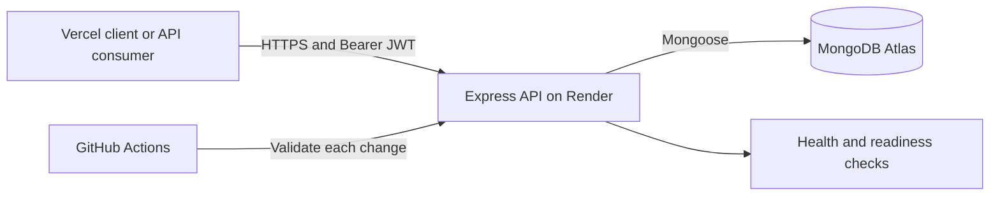

# Expense Tracker API

[](https://github.com/debgourab/expense-tracker-api/actions/workflows/ci.yml)
[](https://nodejs.org/)
[](https://expressjs.com/)
[](https://www.mongodb.com/)
[](LICENSE)

A secure REST API for personal expense tracking. It provides JWT-based
authentication, user-scoped expense management, queryable transaction data,
MongoDB analytics, operational health checks, and a small same-origin demo UI.

[Repository](https://github.com/debgourab/expense-tracker-api) | [OpenAPI specification](docs/openapi.yaml) | [Related client](https://github.com/debgourab/expense-tracker-client) | [Report an issue](https://github.com/debgourab/expense-tracker-api/issues)

[](https://render.com/deploy?repo=https://github.com/debgourab/expense-tracker-api)

## Architecture



The API enforces ownership at the database query level: every expense lookup,
update, delete, and aggregation is scoped to the authenticated user.

## Highlights

- Signup, login, and authenticated profile endpoints
- Password hashing with bcrypt and signed JWT access tokens
- User-scoped create, read, update, and delete operations
- Search, category filtering, date filtering, and configurable sorting
- Category totals and overall/current-month spending analytics
- Strict request validation and consistent JSON errors
- Helmet security headers, CORS allowlisting, and auth rate limiting
- Request IDs, structured HTTP logs, compression, and graceful shutdown
- Liveness and database-readiness endpoints for hosting platforms
- Compound MongoDB indexes for common user/date/category queries
- OpenAPI 3.1 contract and automated HTTP tests
- GitHub Actions CI and a Render Blueprint for repeatable deployments

## Technology

| Area | Technology |
| --- | --- |
| Runtime | Node.js 24 LTS |
| HTTP API | Express.js |
| Database | MongoDB and Mongoose |
| Authentication | JSON Web Token and bcryptjs |
| Security | Helmet, CORS, express-rate-limit |
| Operations | Morgan, request IDs, compression, Render health checks |
| Testing | Node.js test runner and Supertest |
| Deployment | Render Web Service and MongoDB Atlas |

## Project Structure

```text
.
|-- .github/workflows/ci.yml     # Continuous integration
|-- config/
|   |-- database.js              # MongoDB connection lifecycle
|   `-- env.js                   # Validated runtime configuration
|-- docs/openapi.yaml            # OpenAPI 3.1 contract
|-- middleware/
|   |-- authMiddleware.js        # JWT authentication and user lookup
|   |-- errorHandlers.js         # 404 and centralized error responses
|   |-- rateLimiters.js          # Authentication abuse protection
|   `-- requestId.js             # Request tracing
|-- models/                       # User and Expense schemas
|-- public/                       # Optional same-origin demo UI
|-- routes/                       # Authentication and expense endpoints
|-- test/                         # HTTP-level automated tests
|-- app.js                        # Express application composition
|-- server.js                     # Database startup and graceful shutdown
`-- render.yaml                   # Render infrastructure definition
```

## Quick Start

### Requirements

- Node.js 24
- npm 11 or newer
- MongoDB Atlas or a local MongoDB server

### Installation

```bash
git clone https://github.com/debgourab/expense-tracker-api.git
cd expense-tracker-api
npm ci
cp .env.example .env
npm run dev
```

On Windows PowerShell, create the environment file with:

```powershell
Copy-Item .env.example .env
```

The API and demo UI are available at `http://localhost:5000`. Useful checks:

```bash
curl http://localhost:5000/api
curl http://localhost:5000/health
curl http://localhost:5000/ready
```

## Environment Variables

| Variable | Production | Purpose | Example |
| --- | --- | --- | --- |
| `PORT` | Provided by Render | HTTP listening port | `5000` |
| `MONGO_URI` | Required | MongoDB connection string | `mongodb+srv://.../expense-tracker` |
| `JWT_SECRET` | Required | Secret used to sign access tokens | Random 64-byte value |
| `JWT_EXPIRES_IN` | Optional | Access-token lifetime | `1d` |
| `JWT_ISSUER` | Optional | Expected JWT issuer | `expense-tracker-api` |
| `JWT_AUDIENCE` | Optional | Expected JWT audience | `expense-tracker-client` |
| `CLIENT_ORIGIN` | Recommended | Comma-separated CORS allowlist | `https://app.vercel.app` |
| `LOG_FORMAT` | Optional | `dev` or `combined` request logs | `combined` |
| `NODE_ENV` | Required | Enables production safeguards | `production` |

Generate a strong JWT secret locally:

```bash
node -e "console.log(require('node:crypto').randomBytes(64).toString('hex'))"
```

Never expose `MONGO_URI` or `JWT_SECRET` in browser code, Vercel client
variables, logs, screenshots, or committed files.

For multiple browser origins, use exact comma-separated URLs without trailing
slashes:

```env
CLIENT_ORIGIN=http://localhost:5500,https://expense-tracker-client.vercel.app
```

## Authentication Flow

1. The client calls `POST /auth/signup` or `POST /auth/login`.
2. The API returns a signed access token and a safe user object.
3. Protected requests send `Authorization: Bearer <token>`.
4. The API validates the token issuer, audience, expiry, and user account.
5. Expense queries are restricted to that user's MongoDB identifier.

Example login:

```bash
curl -X POST http://localhost:5000/auth/login \
  -H "Content-Type: application/json" \
  -d '{"email":"deb@example.com","password":"strong-password"}'
```

Example protected request:

```bash
curl http://localhost:5000/expenses \
  -H "Authorization: Bearer YOUR_ACCESS_TOKEN"
```

## API Reference

| Method | Endpoint | Authentication | Purpose |
| --- | --- | --- | --- |
| `GET` | `/api` | Public | Service metadata |
| `GET` | `/health` | Public | Process liveness |
| `GET` | `/ready` | Public | MongoDB readiness |
| `GET` | `/openapi.yaml` | Public | Machine-readable API contract |
| `POST` | `/auth/signup` | Public | Create an account |
| `POST` | `/auth/login` | Public | Receive an access token |
| `GET` | `/auth/me` | Bearer token | Read the current user |
| `GET` | `/expenses` | Bearer token | List and query expenses |
| `POST` | `/expenses` | Bearer token | Create an expense |
| `GET` | `/expenses/:id` | Bearer token | Read one owned expense |
| `PUT` | `/expenses/:id` | Bearer token | Update one owned expense |
| `DELETE` | `/expenses/:id` | Bearer token | Delete one owned expense |
| `GET` | `/expenses/dashboard/category-totals` | Bearer token | Aggregate categories |
| `GET` | `/expenses/dashboard/summary` | Bearer token | Aggregate spending metrics |

`GET /expenses` accepts `category`, `search`, `from`, `to`, and `sort` query
parameters. Valid sort values are `newest`, `oldest`, `highest`, and `lowest`.

```text
GET /expenses?search=travel&from=2026-01-01&to=2026-12-31&sort=highest
```

Every response includes an `X-Request-ID` header. Error responses include the
same identifier in the JSON body so a client-side failure can be matched to
server logs.

## Quality Checks

```bash
npm run check       # Parse-check application source
npm test            # Run HTTP contract tests
npm run validate    # Run the complete local/CI validation pipeline
```

GitHub Actions runs `npm run validate` for every push and pull request targeting
`main`. Current tests cover service metadata, liveness, readiness, headers,
request tracing, CORS, validation, malformed JSON, and 404 behavior.

## Deploy To Render

The included `render.yaml` defines the build command, start command, health
check, Node.js version, generated JWT secret, and required secret prompts.

### Blueprint Deployment

1. Push the repository to GitHub.
2. Open the [Render Dashboard](https://dashboard.render.com/).
3. Select **New > Blueprint**.
4. Connect `debgourab/expense-tracker-api`.
5. Enter `MONGO_URI` and the final Vercel URL for `CLIENT_ORIGIN`.
6. Deploy and verify `https://YOUR-SERVICE.onrender.com/health`.

### Manual Web Service Settings

| Setting | Value |
| --- | --- |
| Runtime | Node |
| Branch | `main` |
| Build command | `npm ci --omit=dev` |
| Start command | `npm start` |
| Health check path | `/health` |
| Node version | `24.21.0` |

In MongoDB Atlas, allow every CIDR listed under the Render service's
**Connect > Outbound** panel. A temporary `0.0.0.0/0` rule can help with an
initial deployment, but replace it with Render's outbound ranges afterward.

See the official [Render Node/Express guide](https://render.com/docs/deploy-node-express-app),
[Blueprint reference](https://render.com/docs/blueprint-spec), and
[MongoDB Atlas connection guide](https://www.mongodb.com/docs/atlas/connect-to-database-deployment/).

## Connecting A Vercel Client

The browser client needs only the public Render API URL. In the Vercel project
for `expense-tracker-client`, set:

```env
VITE_API_BASE_URL=https://expense-tracker-api.onrender.com
```

The client build creates a public `config.js` file with that URL. Do not send
server secrets to Vercel. After the client receives a token from signup or
login, it attaches the token to protected requests. Finally, set Render's
`CLIENT_ORIGIN` to the exact Vercel production URL and redeploy the API.

## Security

- Passwords are hashed before persistence and excluded from normal queries.
- JWTs include subject, issuer, audience, and expiry claims.
- Authentication requests are rate limited.
- Expense ownership is enforced in every protected database operation.
- Request bodies are size-limited and reject unsupported expense fields.
- Production secrets fail validation instead of using development fallbacks.
- Vulnerabilities should be reported according to [SECURITY.md](SECURITY.md).

## Contributing

Contributions are welcome. Read [CONTRIBUTING.md](CONTRIBUTING.md), run
`npm run validate`, and update the OpenAPI contract when changing an endpoint.

## Author

**Deb Gourab Biswas**

- GitHub: [@debgourab](https://github.com/debgourab)
- Repository: [expense-tracker-api](https://github.com/debgourab/expense-tracker-api)
- Client repository: [expense-tracker-client](https://github.com/debgourab/expense-tracker-client)

## License

Released under the [MIT License](LICENSE).
